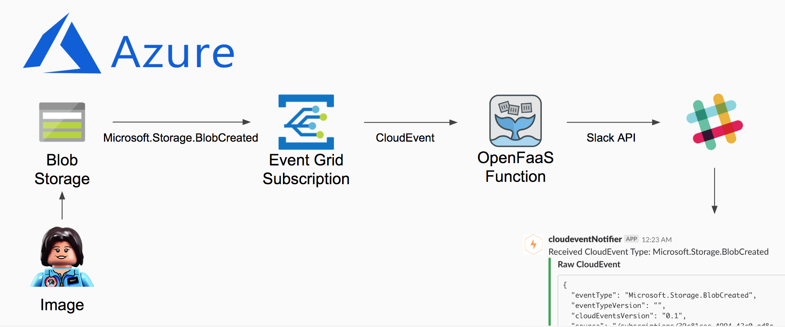

## CloudEvent to Slack OpenFaaS Demo
This repo contains a simple OpenFaaS function which demonstrates how events using the [CloudEvents 0.1 Specification](https://github.com/cloudevents/spec/tree/v0.1) schema can be consumed from Azure EventGrid.

The demo function handles the receipt of a `Microsoft.Storage.BlobCreated` event in `CloudEvents0.1` format, where it will parse the received message, extracting the URL of the created file from the CloudEvent and sending both that URL and the raw CloudEvent message to a configurable Slack Channel for display.

## Building the function

The following steps are optional, you can proceed to deploying the function if you wish to use the prebuilt image. You should also have a look at [OpenFaaS Cloud](https://github.com/openfaas/openfaas-cloud) as it can be used for a hosted GitOps build and deployment flow.

1. `git clone https://github.com/johnmccabe/cloudevents-slack-demo.git`
2. `cd cloudevents-slack-demo`
3. `faas build`
4. If you are making the image public you can also push it to your registry.

       faas push

## Deploying the function

1. Create a secret containing your Slack token, for example on Swarm or Kubernetes.

       echo <slack token> | docker secret create cloudevent-slack-token -

2. Replace `<SLACK_ROOM_ID>` with your Slack room id in `stack.yml`
3. Deploy the function to your OpenFaaS platform

       faas deploy

4. You can now use the deployed functions endpoint in your EventGrid subscription for the Storage event, making sure to set the scheme to `--event-delivery-schema cloudeventv01schema`. For example:

       az eventgrid event-subscription create \
           --resource-id $storageid \
           --name openfaas-cloudevent-demo \
           --endpoint https://xxxxxxxx.ngrok.io/function/cloudevents-slack-demo \
           --event-delivery-schema cloudeventv01schema

## Handling a CloudEvent in OpenFaaS
The function handler converts the received raw request into a `CloudEvent` as follows (with the implementation in `cloudevent.go`):

    c, err := getCloudEvent(req)
    if err != nil {
        log.Fatal(err)
    }

Should the received event not be of type `CloudEvent` the function will exit and an error logged.

## Azure and Slack Handling
The demo handler includes two other Slack/Azure related parts which:

- Responds to an EventGrid Subscription Validation Event to validate the function endpoint for subsequent delivery of events.

      if resp := azureValidationEvent(req); resp != nil {
          return *resp
      }

  This is received from EventGrid when setting up the subscription.

- Checks the CloudEvents `EventType` to determine how to interpret the `Data` payload, in this case it expects a `MicrosoftStorageBlobCreatedType` event payload which it uses to send a message to Slack with `sendmessage()`